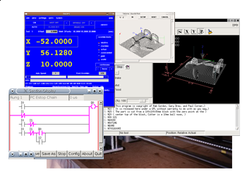

<!-- site built from {{ site.data.version }} -->

LinuxCNC controls CNC machines.  It can drive milling machines, lathes, 3d
printers, laser cutters, plasma cutters, robot arms, hexapods, and more.

* Runs under Linux (optionally with realtime extensions).

* Simple installation on Debian and Ubuntu, or via our Live/Install
  DVD/USB images.

* Accepts G-code input, drives CNC machines in response.

* Active user community.

* Several different GUIs available.

* Compatible with many popular machine control hardware interfaces.

* Supports rigid tapping, cutter compensation, and many other advanced
  control features.

* Full source code available under under the terms of the [GNU GPLv2
  (General Public License version 2)][GPLv2].

  <h1>News</h1>
  <ul class="posts">
    
      <li>
        {{ post.date | date: "%b %-d, %Y" }}
        <a class="post-link" href="{{ post.url | prepend: site.baseurl }}">{{ post.title }}</a>
      </li>
    
      <li><a class="post-link" href="news/">Older news...</a></li>
  </ul>

  
subscribe <a href="{{ "/feed.xml" | prepend: site.baseurl }}">via RSS</a>

  <h1>Showcase</h1>
  
    {{ post.date | date: "%b %-d, %Y" }}
    <h2>
      <a class="post-link" href="{{ post.url | prepend: site.baseurl }}">
        {{ post.title }}
      </a>
    </h2>
    

    {{post.content | markdownify }}
    

  
  <ul class="posts">
    
      <li>
        {{ post.date | date: "%b %-d, %Y" }}
        <a class="post-link" href="{{ post.url | prepend: site.baseurl }}">{{ post.title }}</a>
      </li>
    
      <li><a class="post-link" href="showcase/">Older showcase...</a></li>
  </ul>
  
subscribe to showcase <a href="{{ "/showcase.xml" | prepend: site.baseurl }}">via RSS</a>

[GPLv2]: http://www.gnu.org/licenses/old-licenses/gpl-2.0.html
